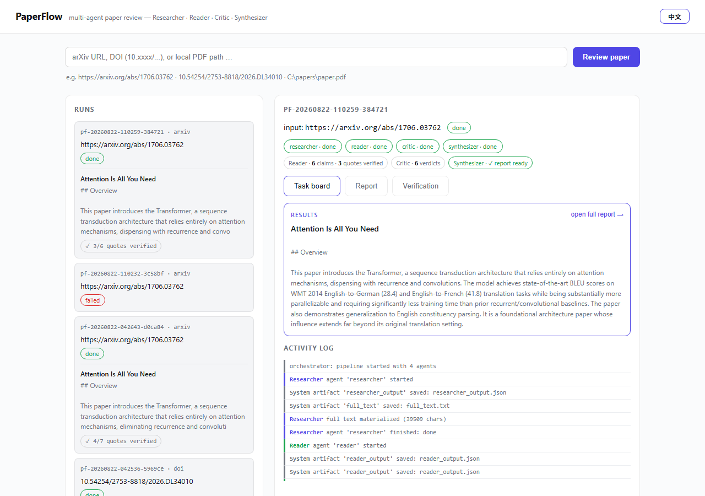
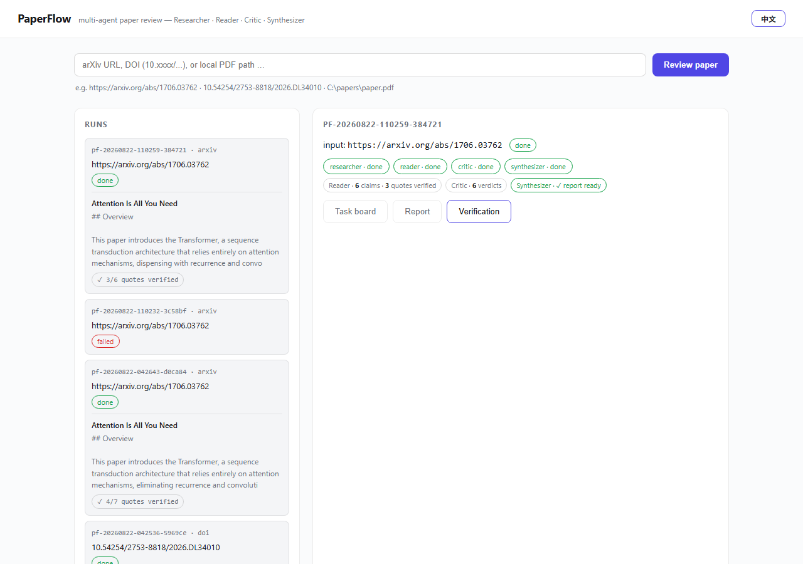

# PaperFlow — Multi-Agent Paper Review

> Drop a paper link / DOI / PDF into the pipeline and a small team of LLM
> agents collaborates through a JSON task board to produce a **structured
> review with related-work links**.

PaperFlow is a lightweight, dependency-minimal **multi-agent research
collaboration system** built on DeepSeek function calling. It was designed as
a portfolio piece demonstrating how to build agent orchestration from
scratch — no LangChain, no agent frameworks — with an explicit, inspectable
tool-calling loop, a persisted task board, and a deterministic scheduler.

It echoes the author's published multi-agent work —
[*Dynamic Belief Networks and Deep-Thinking Probes for Multi-agent Social
Reasoning*](https://doi.org/10.54254/2753-8818/2026.DL34010) (Tongji
University, 2026) — applying the same "team of specialized reasoners" idea
to literature review.

---

## 中文摘要

PaperFlow 是一个**自研轻量多智能体科研协作系统**：输入论文链接 / DOI / PDF，
四个专职 Agent（Researcher 检索、Reader 结构化解析、Critic 对照原文事实核查、
Synthesizer 整合综述）通过 **JSON 任务板**协作，产出结构化审阅 + 相关工作链接。

- **不依赖 LangChain 等重框架**：Agent 基类 + 工具注册机制 + 任务板（JSON 状态文件）+ 确定性编排器，代码清晰可扩展
- **DeepSeek function calling**（`deepseek-chat`），工具调用循环显式可见、可测试
- 三种入口：arXiv URL / DOI / 本地 PDF；CLI 一键跑 + 轻量 FastAPI Web 看板（实时任务板进度 + 最终报告）
- 该项目的多智能体编排思路与本人在狼人杀多智能体论文
  （DOI `10.54254/2753-8818/2026.DL34010`，DBN 动态信念网络 + DTR 探针）一脉相承

---

## Why

Literature review has two pain points: **reading** (understanding a paper's
structure, claims and numbers) and **contextualizing** (linking it to related
work and judging its relevance). PaperFlow splits the job across four agents
with distinct responsibilities and lets them hand off artifacts through a
shared, human-readable task board:

```
┌──────────────────────────────────────────────────────────────────┐
│                        Task Board (JSON)                         │
│  input ──► agents{researcher, reader, critic, synthesizer}       │
│            artifacts{paper_info, full_text, reader_output,       │
│                      critic_output}   report{path, preview}      │
└──────────────────────────────────────────────────────────────────┘
        ▲                                                           │
        │ persist after every transition                            │
┌───────┴───────────────────────────────────────────────────────────┐
│ Orchestrator  (deterministic scheduler, dependency-aware)         │
│                                                                   │
│  Researcher ──► Reader ──► Critic ──► Synthesizer ──► report.md   │
│      │               │          │            │                    │
│   arxiv_search   (no tools)  search_text   arxiv_search          │
│   resolve_doi    reads full  verifies      (related work)        │
│   fetch_url      text +      quotes vs     + relevance score     │
│   fetch_pdf_text metadata    the paper     vs research focus      │
│   read_pdf                          text                         │
└───────────────────────────────────────────────────────────────────┘
        ▲                                                           │
        │ function-calling loop (explicit, max-round guarded)       │
┌───────┴───────────────────────────────────────────────────────────┐
│ DeepSeek chat/completions (deepseek-chat) + ToolRegistry          │
└───────────────────────────────────────────────────────────────────┘
```

**Design notes**

- **Tool registry** — tools are plain functions wrapped in a `ToolSpec`
  (name / description / JSON Schema / callable). The registry serves both
  the LLM (OpenAI-compatible schemas) and the runtime (execution with
  `call_safe`, so tool failures become LLM-readable `TOOL ERROR` messages).
- **Task board** — a JSON file is the single source of truth for a run.
  The orchestrator persists it after every agent transition, which is what
  makes the web dashboard "live" and crashed runs inspectable.
- **Function-calling loop** — `LLMClient.solve()` is a visible, testable
  loop: send conversation + schemas → execute requested tools via the
  registry → feed results back → repeat until a final answer or the round
  budget is exhausted.
- **Full text is extracted once into a content-addressed file** — the
  Researcher turns the PDF into plain text a single time and stores it on
  the board. The Reader receives the (truncated) full text in its context
  to ground its claims; the Researcher, Critic and Synthesizer only ever
  exchange *paths and previews*, keeping token cost low and quotes
  checkable. Every Reader quote is then verified deterministically against
  the stored text (see below).
- **Graceful degradation** — the Critic is optional: if fact-checking fails,
  the pipeline continues and the report says so honestly.

---

## Quick start

Requires Python ≥ 3.10 and a [DeepSeek](https://platform.deepseek.com) API key.

```bash
git clone <this-repo> && cd paperflow
python -m venv .venv
.venv\Scripts\activate                # Windows  (macOS/Linux: source .venv/bin/activate)
pip install -r requirements.txt

# Windows:  copy .env.example .env
# macOS/Linux: cp .env.example .env
# then put your DEEPSEEK_API_KEY in .env
```

### CLI

```bash
# arXiv URL
python -m paperflow run "https://arxiv.org/abs/1706.03762"

# DOI (the author's own paper, with a local PDF for full text)
python -m paperflow run "10.54254/2753-8818/2026.DL34010" \
    --pdf path/to/werewolf-paper.pdf

# local PDF
python -m paperflow run path/to/paper.pdf

# results
#   outputs/<run-id>/board.json      <- task board (live state machine)
#   outputs/<run-id>/report.md       <- final structured review
```

The key can also come from any `.env` file:

```bash
python -m paperflow run "https://arxiv.org/abs/1706.03762" \
    --env-file "D:\secrets\.env" --out outputs
```

### Web dashboard

```bash
python -m paperflow serve --port 8080
# open http://127.0.0.1:8080 — paste an entry, watch the task board update
# live, read the rendered report
```





The dashboard is **bilingual (EN / 中文, toggle top-right, default English)**,
with three tabs: **Task board** (live agent states, an **execution timeline**
of the four agents, and a color-coded per-agent activity log), **Report**
(rendered review; claims that appear in the verification data get clickable
`[#n]` markers that jump to their verification card) and **Verification** — a
per-claim view of the deterministic quote check: every claim's quote,
whether the code found it verbatim in the paper text, where it was found,
and the critic's verdict.

Finished runs show their **results directly in the run list**: a report
preview, a "✓ n/m quotes verified" badge and (for failed runs) the failing
stage and reason. Selecting a run whose report is ready opens a **results
summary card** at the top of the task board.

> The dashboard binds `127.0.0.1` by default and the fetch tools refuse
> private/loopback/link-local URLs (SSRF guard). It is a local tool — do
> not expose it publicly with `--host 0.0.0.0`. Runs interrupted by a
> server restart are shown as **interrupted** (covered by tests).

### Tests

```bash
python -m pytest                      # offline suite (no network, fake LLM)
python -m pytest -m smoke             # real arXiv / Crossref API smoke tests
node tests/test_markdown.mjs          # dashboard markdown renderer (tables) — not part of pytest
```

---

## Example output (excerpt)

Running the **author's own werewolf paper** (DOI `10.54254/2753-8818/2026.DL34010`)
produces a report like this — the first 20 lines are copied verbatim from
[`examples/werewolf-dbn/report.md`](examples/werewolf-dbn/report.md):

```markdown
# Dynamic Belief Networks and Deep-Thinking Probes for Multi-agent Social Reasoning

## Overview

This paper proposes a framework combining a **Dynamic Belief Network (DBN)** and a **Deep-Thinking Token Ratio (DTR) probe** to address two longstanding problems in LLM-powered multi-agent social deduction: recursive agreement between homogeneous agents and stable detection of deception. The framework is evaluated in nine-player Werewolf across 3000 simulated games (six configurations × 500 games) using DeepSeek-V3.2 agents. The DBN maintains per-player suspicion estimates via exponential moving average (EMA) smoothing (α=0.3), while the DTR probe uses logit-lens to measure Jensen-Shannon divergence across transformer layers of a separate probe model (Qwen2.5-3B-Instruct) as a proxy for cognitive load. Results show that combining DBN with MaKTO-Proxy reasoning raises villager win rate from 44.2% to 68.8%, and adding DTR further improves vote accuracy (to 66.6%) but reduces survival, revealing a non-monotonic relationship between individual capability and collective payoff, interpreted through the lens of the handicap principle.

## Method

The framework consists of three modules combined across six configurations (A–F):

1. **MaKTO-Proxy**: few-shot chain-of-thought prompting to elicit reasoning.
2. **Dynamic Belief Network (DBN)**: per-player suspicion estimates updated each round via EMA smoothing with α=0.3, designed to dampen the positive-feedback loop between homogeneous models.
3. **Deep-Thinking Token Ratio (DTR) probe**: computes the average Jensen-Shannon divergence between layerwise logit-lens distributions of a separate probe model (Qwen2.5-3B-Instruct) to estimate cognitive load of utterances, relying on cross-architecture inference.

Experiments run 500 games per configuration in nine-player Werewolf with DeepSeek-V3.2 agents. Metrics include villager win rate, vote accuracy, mean survival rounds, and Brier Score convergence. Sensitivity analysis on α (0.1/0.3/0.5) is conducted under Configuration C.

## Key Claims & Evidence

- **Unassisted baseline achieves 44.2% villager win rate, lower than random.** **[supported]** — Table 2 confirms Group A win rate 44.2%; quote found verbatim.
- **Combining MaKTO-Proxy and DBN increases win rate to 68.8%.** **[supported]** — Table 2 confirms Group E win rate 68.8%, a ~24.6 pp increase over baseline.
```

---

## Project layout

```
paperflow/
├── paperflow/
│   ├── config.py            # .env loading, Settings (secrets stay out of git)
│   ├── ingest.py            # entry normalization: arxiv | doi | pdf | url | title
│   ├── pipeline.py          # one-call Pipeline: board + registry + team
│   ├── cli.py               # `paperflow run|serve|version`
│   ├── core/
│   │   ├── agent.py         # Agent base class (prompt / tools / artifacts)
│   │   ├── board.py         # JSON task board (atomic saves, agent states)
│   │   ├── llm.py           # DeepSeek client + explicit function-calling loop
│   │   ├── orchestrator.py  # dependency-aware scheduler, critical/optional
│   │   └── tools.py         # ToolSpec + ToolRegistry
│   ├── tools/               # arxiv_search, resolve_doi, fetch_url,
│   │                        # fetch_pdf_text, read_pdf, search_text
│   ├── agents/              # Researcher · Reader · Critic · Synthesizer
│   └── web/                 # FastAPI dashboard + static page
├── tests/                   # offline suite (fake LLM) + smoke tests
└── examples/                # committed sample runs
```

---

## Limitations (known)

- **Single-pass reading**: the Reader processes the full text in one context
  window (default cap 60k chars). Very long papers are truncated; chunked /
  hierarchical reading is future work.
- **DeepSeek `deepseek-chat` only**: no reasoning-model or multi-provider
  abstraction yet (the `LLMClient` interface makes this straightforward).
- **Sequential orchestration**: agents run in a fixed pipeline order; a
  parallel / map-reduce mode (multiple Readers per section) is not built.
- **Abstract-only mode**: when no full text can be obtained (e.g. a DOI
  without an open-access PDF), the review is based on the abstract and the
  Critic marks claims *unverifiable*.
- **Network dependence**: arXiv/Crossref/DeepSeek calls need internet;
  arXiv's public API is rate-limited (the client enforces a ≥3s interval).

---

## Credits

- [arXiv API](https://info.arxiv.org/help/api/index.html) — public metadata/PDF source (no key required)
- [Crossref REST API](https://api.crossref.org) — DOI → metadata resolution
- [DeepSeek API](https://platform.deepseek.com) — LLM + function calling
- [pypdf](https://pypi.org/project/pypdf/) — PDF text extraction
- [FastAPI](https://fastapi.tiangolo.com/) / [Uvicorn](https://www.uvicorn.org/) — web dashboard
- Sample: the author's own open-access paper (CC-BY 4.0), DOI `10.54254/2753-8818/2026.DL34010`

## License

MIT — see [LICENSE](LICENSE).
